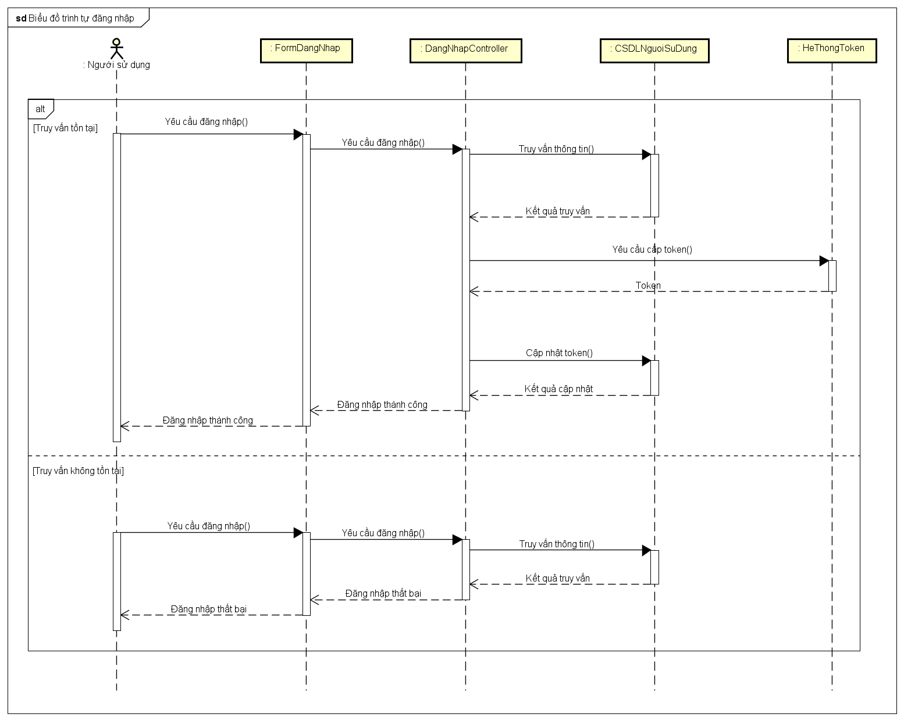
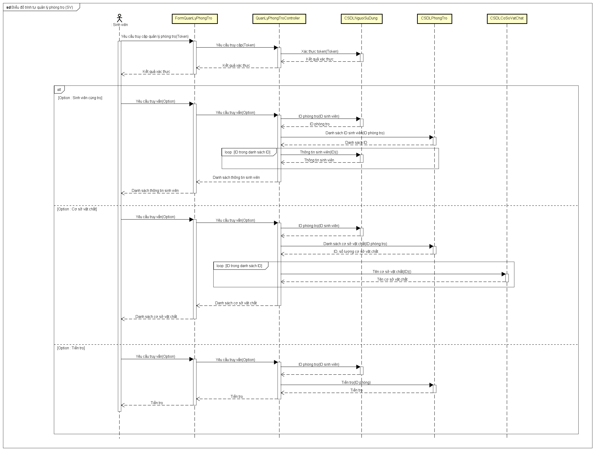
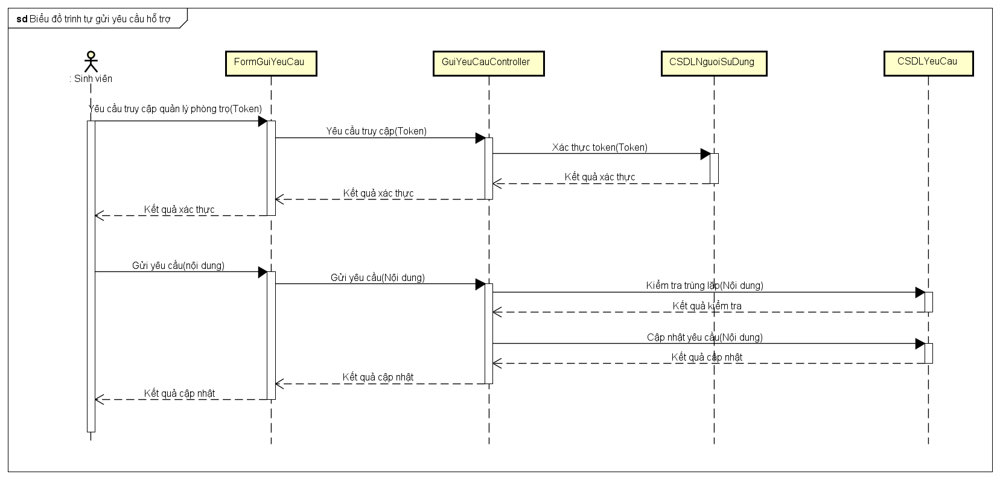
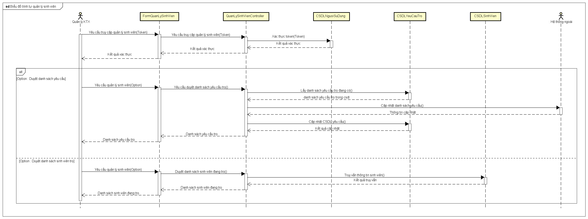

# Phân tích và thiết kế hệ thống : Biểu đồ trình tự

## 0. Đăng nhập :

## 1. Biểu đồ trình tự cho actor sinh viên : 

### 1.1. Quản lý phòng trọ :

### 1.2. Gửi yêu cầu hỗ trợ :

## 2. Biểu đồ trình tự cho actor quản lý ký túc xá :

### 2.1. Quản lý sinh viên :

### 2.2. Quản lý phòng trọ : 

.png)

### 2.3. Quản lý yêu cầu hỗ trợ :

### 2.4. Quản lý gửi xe : 

### 2.5. Tổng hợp, báo cáo : 

- [x] Đăng nhập
- [x] Gửi yêu cầu hỗ trợ
- [x] Quản lý sinh viên
- [x] Quản lý phòng trọ 
- [ ] Quản lý yêu cầu hỗ trợ
- [ ] Quản lý gửi xe
- [ ] Tổng hợp, báo cáo