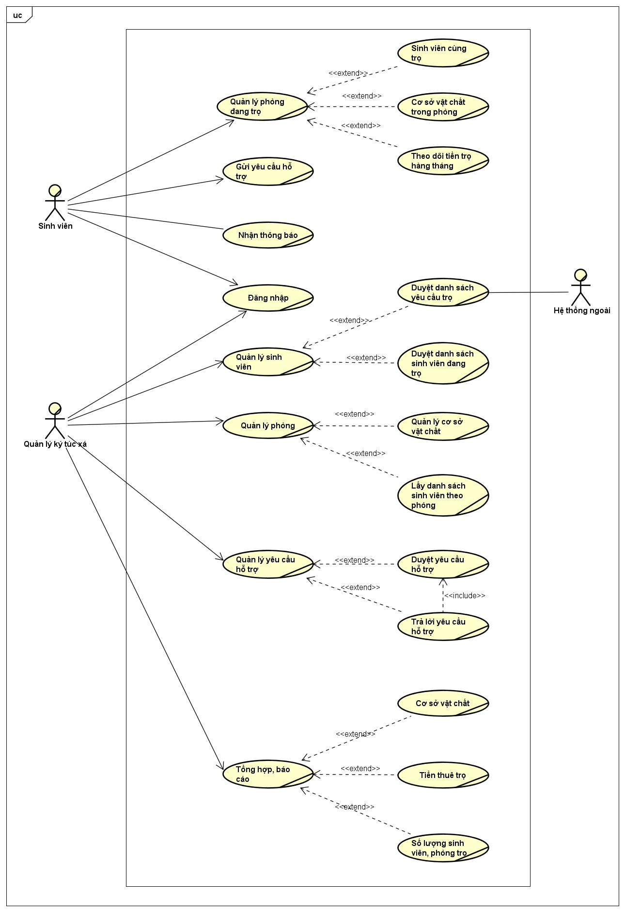

# Xác định yêu cầu phần mềm

## 1. Biểu đồ Usecase :

## 2. Đặc tả Usecase :

### 2.1. Usecase quản lý phòng trọ :

_ **Đối tượng sử dụng** : Sinh viên đã có tài khoản.

_ **Đầu vào** : Yêu cầu tra cứu thông tin của sinh viên.

_ **Đẩu ra** : Thông tin tương ứng với yêu cầu.

_ **Các bước** : 

- Sinh viên lựa chọn chức năng quản lý phòng trọ.
- Sinh viên chọn mục thông tin cần tìm kiếm :
  - Danh sách bạn cùng phòng.
  - csvc được cấp/trong danh mục cần quản lý.
  - Tiền trọ.
- Hệ thống thực hiện truy vấn và gửi về kết quả cho sinh viên.

### 2.2. Usecase gửi yêu cầu hỗ trợ :

_ **Đối tượng sử dụng** : Sinh viên đã có tài khoản.

_ **Đầu vào** : Yêu cầu hỗ trợ của sinh viên.

_ **Đẩu ra** : Trạng thái của yêu cầu.

_ **Các bước** : 

- Sinh viên truy cập chức năng gửi yêu cầu hỗ trợ.
- Sinh viên nhập yêu cầu hỗ trợ.
- Hệ thống lưu yêu cầu hỗ trợ và trả về số thứ tự trong hàng đợi.

### 2.3. Usecase đăng nhập :

_ **Đối tượng sử dụng** : Sinh viên và quản lý KTX đã có tài khoản.

_ **Đầu vào** : Tên đăng nhập và mật khẩu của người sử dụng.

_ **Đẩu ra** : Trạng thái đăng nhập của tài khoản.

_ **Các bước** :

- Người dùng nhập vào tên đăng nhập và mật khẩu của mình.
- Hệ thống kiểm tra trong cơ sở dữ liệu.
- Hệ thống trả về thông tin :
  - Nếu đúng : Hệ thống chuyển hướng đến trang chủ.
  - Nếu sai : Hệ thống thông báo sai thông tin và yêu cầu nhập lại

### 2.4. Usecase quản lý sinh viên :

_ **Đối tượng sử dụng** : Quản lý KTX.

_ **Đầu vào** : Yêu cầu truy vấn sinh viên.

_ **Đẩu ra** : Thông tin được truy vấn.

_ **Các bước** :

- Người quản lý lựa chọn chức năng quản lý sinh viên.
- Quản lý KTX có thể tìm kiếm danh sách sinh viên theo trạng thái :
  - Danh sách sinh viên có nhu cầu vào ở KTX.
    - Hệ thống gửi yêu cầu đến hệ thống khác.
    - Hệ thống cập nhật với danh sách đang có.
    - Hệ thống hiển thị danh sách cho người quản lý.
  - Danh sách sinh viên đang trọ ở trong KTX.
    - Hệ thống tìm kiếm trong cơ sở dữ liệu.
    - Hệ thống hiển thị danh sách theo các tiêu chí tìm kiếm cho người quản lý.

### 2.5. Usecase quản lý phòng : 

_ **Đối tượng sử dụng** : Quản lý KTX.

_ **Đầu vào** : Các tiêu chí tìm kiếm.

_ **Đẩu ra** : Kết quả thỏa mãn các tiêu chí.

_ **Các bước** :

- Người quản lý lựa chọn chức năng quản lý phòng.
- Quản lý có thể lựa chọn truy vấn csvc hoặc sinh viên theo phòng.
- Hệ thống tìm kiếm theo các tiêu chí được đưa ra.
- Hệ thống hiển thị kết quả

### 2.6. Usecase quản lý yêu cầu hỗ trợ : 

_ **Đối tượng sử dụng** : Quản lý KTX.

_ **Đầu vào** : Yêu cầu duyệt danh sách hỗ trợ.

_ **Đẩu ra** : Danh sách yêu cầu hỗ trợ.

_ **Các bước** :

- Quản lý KTX lựa chọn chức năng duyệt yêu cầu hỗ trợ.
- Hệ thống lấy danh sách yêu cầu hỗ trợ.
- Hệ thống hiển thị danh sách yêu cầu hỗ trợ.
  - Người quản lý có thể trả lời yêu cầu hỗ trợ.
  - Nếu yêu cầu hỗ trợ được trả lời, hệ thống gửi thông báo đến cho sinh viên tạo yêu cầu.

### 2.7. Usecase quản lý gửi xe : 

_ **Đối tượng sử dụng** : Quản lý ký túc xá.

_ **Đầu vào** : Yêu cầu tra cứu danh sách gửi xe của sinh viên.

_ **Đẩu ra** : Danh sách gửi xe của sinh viên

_ **Các bước** :

- Quản lý KTX chọn chức năng quản lý gửi xe.
- Hệ thống tìm kiếm danh sách vé gửi xe của sinh viên.
- Hệ thống hiển thị danh sách vé gửi xe của sinh viên.
- Quản lý KTX có thể gia hạn vé gửi xe của sinh viên :
  - Hệ thống cập nhật danh sách vé gửi xe của sinh viên.
  - Hệ thống trả về kết quả của yêu cầu cập nhât.

### 2.8. Usecase tổng hợp, báo cáo : 

_ **Đối tượng sử dụng** : Quản lý KTX.

_ **Đầu vào** : Tiêu chí cần tổng hợp, xuất báo cáo.

_ **Đẩu ra** : Báo cáo của tiêu chí được yêu cầu.

_ **Các bước** :

- Quản lý KTX lựa chọn chức năng tổng hợp báo cáo.
- Quản lý đưa ra tiêu chí cần xuất báo cáo : 
  - Mục : Csvc, tiền thuê trọ, sinh viên, phòng trọ.
  - Thời gian.
- Hệ thống truy vấn thông tin theo tiêu chí.
- Hệ thống tạo báo cáo.
- Hệ thống hiển thị báo cáo.

## 3. Từ điển thuật ngữ : 

_ *KTX* : Ký túc xá.

_ *CSVC* : Cơ sở vật chất. 