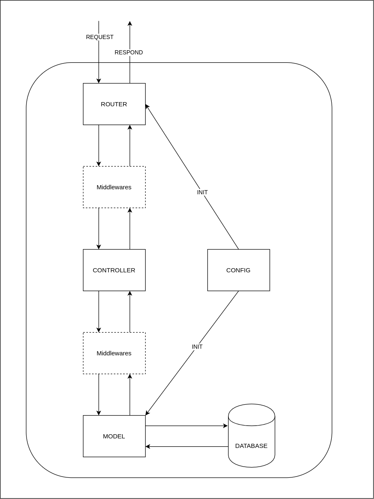

# Backend

## MỤC LỤC

## Thiết kế hệ thống



## Các thư viện ngoài sử dụng

1.[Gin-Gonic](https://github.com/gin-gonic):

- Một trong các framework nổi tiếng của Go.

- Có tốc độ cao và nhiều middlewares hỗ trợ.

2.[gORM](https://gorm.io/)

- Thư viện hỗ trợ ORM(Object-relational mapping cho Go)

3.[Viper](https://github.com/spf13/viper)

- Thư viện hỗ trợ đọc và cài đặt cấc biến môi trường cho Go.

4.[Bcrypt](https://pkg.go.dev/golang.org/x/crypto/bcrypt?tab=doc)

- Thư viện dùng cho việc mã hóa, hash trong Go.

5.[uuid](github.com/twinj/uuid)

6.[Jwt-go](github.com/dgrijalva/jwt-go)

## Danh sách các API đang cung cấp

### health

1. check: kiểm tra hoạt động của server

### user

1. POST - login: đăng nhập:

    1.1 Login form:

    ```JSON
    {
        "username" : "text",
        "password" : "text",
    }
    ```

    1.2 Chi tiết:

    - Token Expire time : 15 phút

    - Refresh Token Expire time :  1 tuần

    1.3 Reply JSON:

    ```JSON
    {
        "message": "Invalid form",
    }
    ```

    ```JSON
    {
        "message": "Invalid login details",
    }
    ```

    ```JSON
    {
        "message": "login success",
        "user":    user,
        "token":   token,
    }
    ```

    1.4. Token:

    ```JSON
    {
        "access_token": ,
        "refresh_token":,
    }
    ```

    1.5. User:

    ```JSON
    {
        "ID":,
        "CreatedAt":,
        "UpdatedAt",
        "DeletedAt",
        "username":,
        "password":,
    }
    ```

## TODO LIST

- [x] login

- [ ] Quản lý sinh viên

  - [ ] Lấy danh sách sinh viên đang trọ.

- [ ] Quản lý phòng

  - [ ] Danh sách sinh viên theo phòng.
  - [ ] Danh sách cơ sở vật chất theo phòng.
