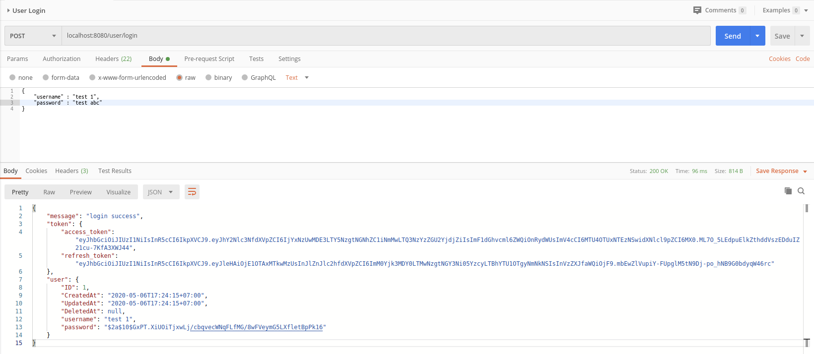
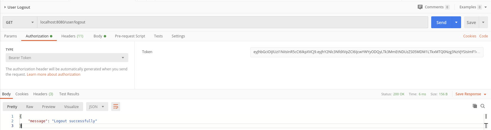
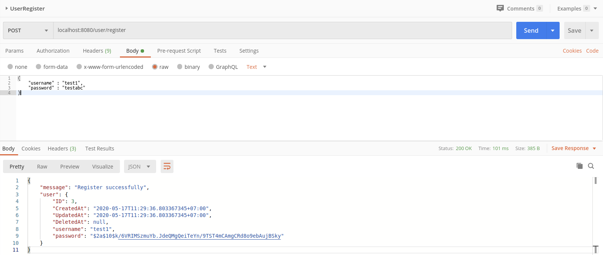

# Backend

## MỤC LỤC

### [I. Thiết kế hệ thống](#thiết-kế-hế-thống)

### [II. Các thư viện ngoài sử dụng](#các-thư-viện-ngoài-sử-dụng)

### [III. Danh sách các API đang cung cấp](#danh-sách-các-api-đang-cung-cấp)

#### [POSTMAN](#POSTMAN)

#### [health](#health)

##### [1. check](#1-check-kiểm-tra-hoạt-động-của-server)

#### [user](#user)

##### [1. login](#1-loginpost)

##### [2. logout](#2-logoutget)

##### [3. register](#3-registerpost)

### [TODO LIST](#todo-list)

## Thiết kế hệ thống


## Các thư viện ngoài sử dụng

1.[Gin-Gonic](https://github.com/gin-gonic):

- Một trong các framework nổi tiếng của Go.

- Có tốc độ cao và nhiều middlewares hỗ trợ.

2.[gORM](https://gorm.io/)

- Thư viện hỗ trợ ORM(Object-relational mapping cho Go)

3.[Viper](https://github.com/spf13/viper)

- Thư viện hỗ trợ đọc và cài đặt cấc biến môi trường cho Go.

4.[Bcrypt](https://pkg.go.dev/golang.org/x/crypto/bcrypt?tab=doc)

- Thư viện dùng cho việc mã hóa, hash trong Go.

5.[uuid](https://github.com/twinj/uuid)

6.[Jwt-go](https://github.com/dgrijalva/jwt-go)

## [SQL TABLES](https://github.com/ThanhPP/HUST_20192_QuanLyKyTucXa/blob/master/app/backend/SQL.md)

## Danh sách các API đang cung cấp

### [POSTMAN](https://www.getpostman.com/collections/8894497461d3adc2ec1e)

### health

#### 1. check: kiểm tra hoạt động của server

### user

#### 1. login(POST)

1.1 Login form:

```JSON
{
    "username" : "text",
    "password" : "text",
}
```

1.2 Chi tiết:

- Token Expire time : 15 phút

- Refresh Token Expire time :  1 tuần

1.3 Reply JSON:

```JSON
{
    "message": "Invalid form",
}
```

```JSON
{
    "message": "Invalid login details",
}
```

```JSON
{
    "message": "login success",
    "role":    "role",
    "token":   "token",
}
```

1.4. Token:

```JSON
{
    "access_token": "",
    "refresh_token": "",
}
```

1.5. User:

```JSON
{
    "ID": "",
    "CreatedAt":"",
    "UpdatedAt":"",
    "DeletedAt":"",
    "username":"",
    "password":"",
}
```

1.6. Hình ảnh :


1.7. Cách xác thực :

- [Bearer Token](https://learning.postman.com/docs/postman/sending-api-requests/authorization/#bearer-token)

- [Mẫu postman Request](https://www.postman.com/collections/7f941b400a88ddd9c137)

##### 2. logout(GET)

2.1. Hình ảnh :


2.2. Reply JSON:

```JSON
{
    "message": "Logout successfully"
}
```

```JSON
{
    "message": "User not logged in"
}
```

##### 3. register(POST)

3.1. Register form :

```JSON
{
    "username" : " ",
    "password" : " "
}
```

3.2. Reply JSON :

```JSON
{
    "message": "Invalid format"
}
```

```JSON
{
    "message": "Username existed"
}
```

```JSON
{
    "message": " ",
    "user": {
        "ID": 0,
        "CreatedAt": " ",
        "UpdatedAt": " ",
        "DeletedAt": null,
        "username": " ",
        "password": " "
    }
}
```

3.1. Hình ảnh :


- [x] Authorize Header

### lv0(level 0 - sinh viên)


## TODO LIST

- [x] login

- [ ] Quản lý sinh viên

  - [ ] Lấy danh sách sinh viên đang trọ.

- [ ] Quản lý phòng

  - [ ] Danh sách sinh viên theo phòng.
  - [ ] Danh sách cơ sở vật chất theo phòng.
